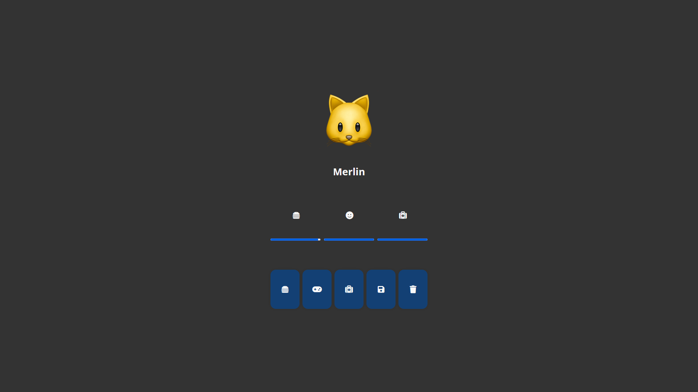

# Tamagotchi

Un jeu de Tamagotchi simple en HTML, CSS et JavaScript.

## Comment jouer

Ouvrez le fichier `index.html` dans votre navigateur. Vous pouvez également l'essayer en ligne [ici](https://enioaiello.github.io/tamagotchi/).\
Dans ce jeu, vous devez prendre soin de votre Tamagotchi en le nourrissant, en le lavant et en le divertissant.\
Chaque action coûte de l'énergie à votre Tamagotchi, et si son énergie atteint 0, il meurt.

[//]: # (Vous pouvez également jouer à des mini-jeux pour gagner de l'argent et acheter des objets pour votre Tamagotchi.)

## Fonctionnalités

- Nourrir votre Tamagotchi
- Soigner votre Tamagotchi
- Jouer avec votre Tamagotchi

## Captures d'écran

## À faire

- Ajouter des mini-jeux

## Historique des versions

- **1.0.0 :** Version initiale

## Licence

Ce projet est sous [licence MIT](LICENSE).